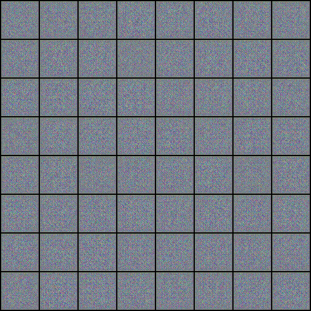

# faceanimator
Face generation GAN algorithm which then gets converted into cartoon characters and animated using AI.

## Training progress visualization.

## 15-minute training loss graph for 64 x 64 groundtruth images.

